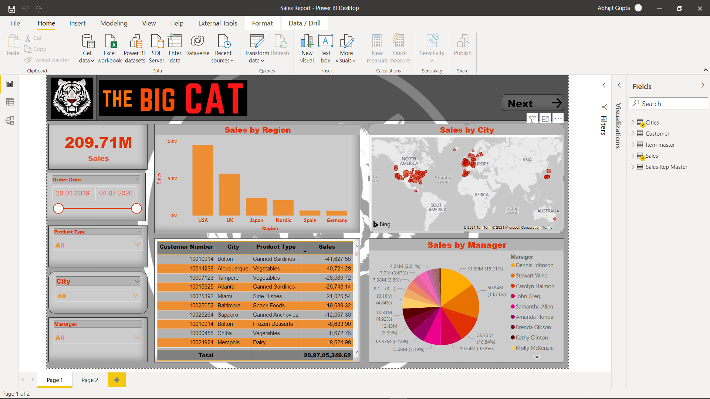
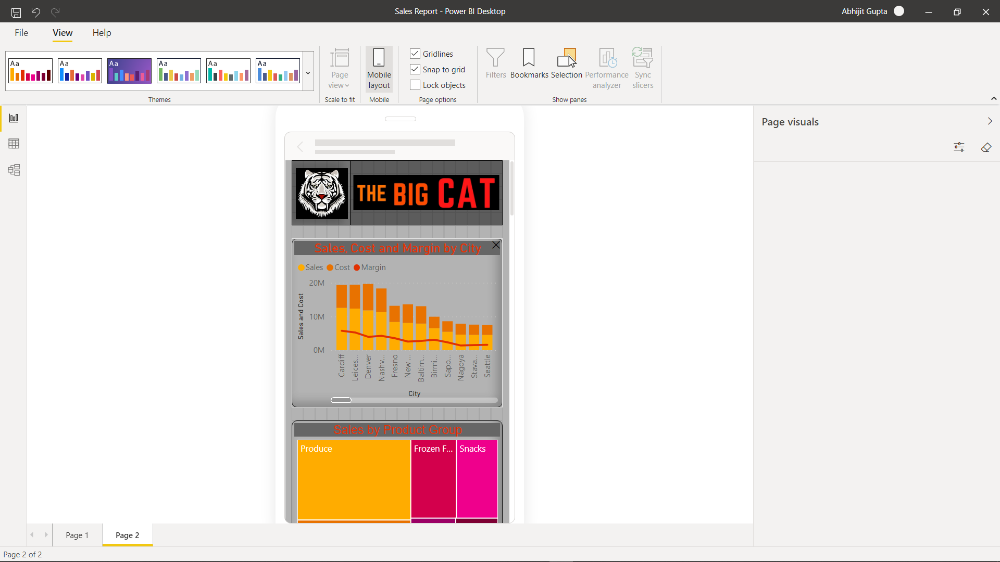

# Sales-Dashboard
Sales report and Dashboard using Power BI.

Here's a Data-Analysis project of Sales Report using Power-BI. Check out my project and give your valuable review.

# These are some Screenshot of Sales Report.

# These are the screenshot of mobile-layout.

Please do ⭐ the repository, if you like this.😊

### Connect with me:

[][twitter]
[][linkedin]
[][instagram]

 

 
 📧 Email : mvishishtkapoor2@gmail.com

